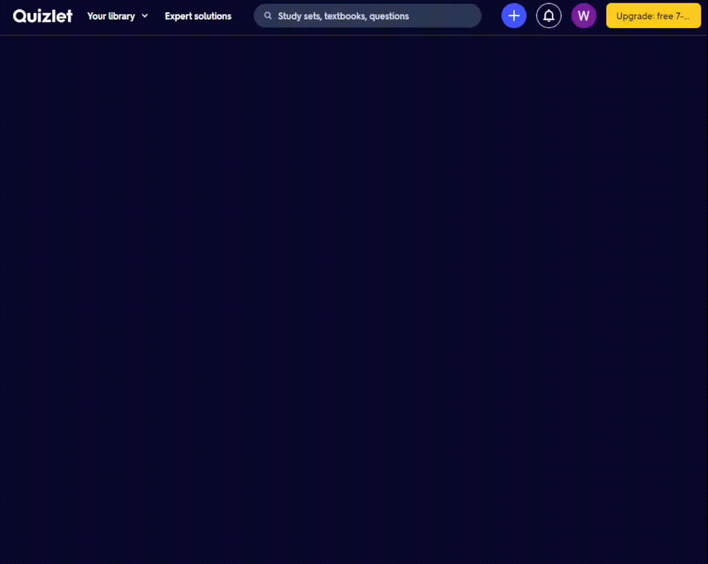
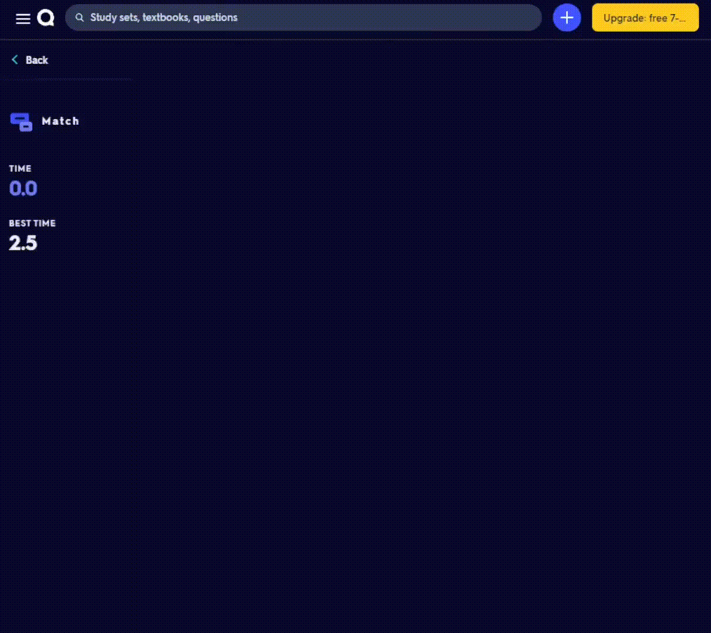

# Quizlet Match Solver
This tool can be used in Chromium browsers, follow the [install guide](#install-guide) in order to install it

As of now the tool can solve Quizlet Matches in half a second (any lower is disregarded by Quizlet)

## Todo
* [X] Allow the tool to automatically grab the list of words for a specific set of cards from the Quizlet Server
* [ ] Add a popup containing options
* [X] Add support for cards with newlines (\n)
* [ ] Add a cache for cards so we don't have to constantly fetch them from the server
* [ ] Add support for images on cards
* [X] Speed up the tool to the minimum Quizlet time
* [X] Refactor code
    * [X] Add comments for readability

## This tool in action

## Install guide
1. Download the GitHub repo by clicking the green "Code" button and clicking "Download ZIP"
    * Alternatively, click [here](https://github.com/Whitelisted1/Quizlet_Match_Solver/archive/refs/heads/main.zip)
2. Unzip the `.zip` file (If you don't know how, there are plenty of guides online)
3. Go to the URL `chrome://extensions`
4. Enable the "Developer Mode" toggle
5. Click "Load unpacked" and navigate to the extracted folder
6. Click "Select Folder" and the extension should load

## Thanks for checking this tool out
If you do like the extension, consider leaving a star